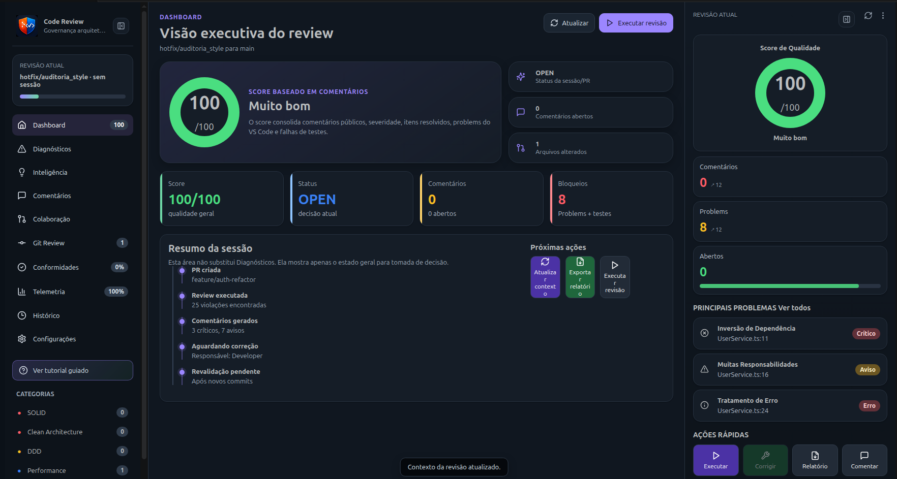
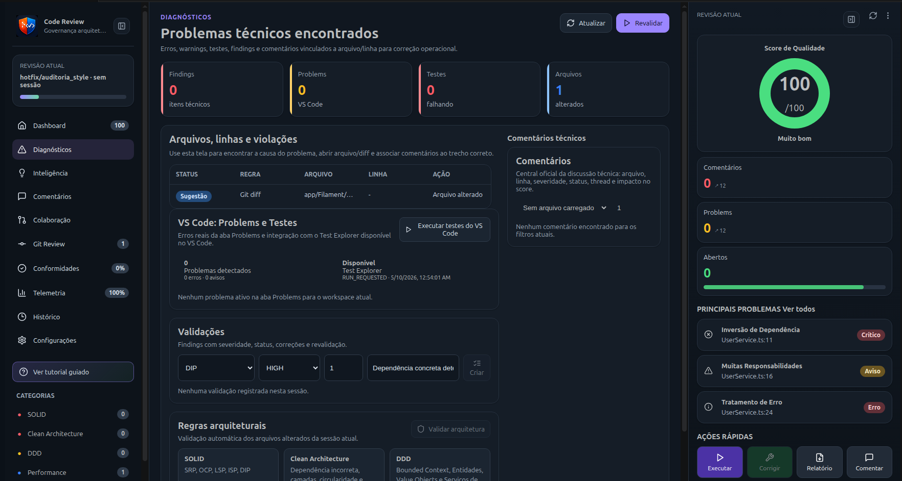

# Code Review Design Extension

Professional VS Code extension for architectural code review, Pull Request analysis, and engineering telemetry with Material Design 3.

## Features

- **Architectural Analysis**: Detect SOLID, Clean Architecture, and DDD violations.
- **Git Integration**: Review commits, branches, and Pull Requests directly in VS Code.
- **Smart Diff**: Visualize architectural impact per layer and file.
- **Telemetry**: Track quality score, error frequency, and correction time.
- **Collaboration**: Register findings with severity, status, and audit history.
- **Audit & Persistence**: Versioned local database with NDJSON audit logs.
- **Onboarding**: Interactive guided tour for new users.

## Getting Started

1. **Installation**: Install the extension from the VS Code Marketplace.
2. **Open Sidebar**: Click on the **Code Review** icon in the Activity Bar (or use `Ctrl+Alt+R`).
3. **Tutorial**: On first launch, follow the interactive tour to learn the basics.
4. **Start a Review**: Use the "Iniciar Revisão" button to analyze your current branch or a specific PR.

## Commands

- `Code Review: Abrir Dashboard` (`Ctrl+Alt+R`)
- `Code Review: Iniciar Revisão` (`Ctrl+Alt+Shift+R`)
- `Code Review: Exportar Auditoria` (`Ctrl+Alt+E`)
- `Code Review: Exportar Banco Local` (`Ctrl+Alt+D`)
- `Code Review: Criar Backup` (`Ctrl+Alt+B`)
- `Code Review: Sincronizar Remoto` (`Ctrl+Alt+S`)

## Architecture

This extension follows **Clean Architecture** principles:
- `domain`: Core business rules and entities.
- `application`: Use cases and orchestration.
- `infrastructure`: Git, VS Code API, and persistence.
- `presentation`: React Webview with Material Design 3.

## License

MIT © 2026 Giovani Rodrigo
