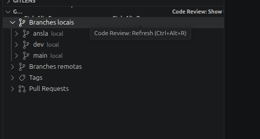

# Git Code Review Local

Review Git history, changed files, diffs, GitHub Pull Requests, and GitLab Merge Requests directly from VS Code.

**Git Code Review Local** adds a focused `Git Review` view to the Source Control panel, helping you inspect branches, tags, commits, review progress, and Pull Requests without leaving the editor.

## Highlights

- Browse local branches, remote branches, tags, commits, and changed files.
- See repository context such as current branch, HEAD, upstream, sync state, and working tree counts.
- Fetch and prune remote branches from the `Git Review` view.
- Open native VS Code diffs or GitHub-style patch diffs.
- Open a full review panel with commit metadata, statistics, filters, search, and multi-select.
- Prioritize files by category, risk level, and explainable review reasons.
- Create saved review processes and resume them later.
- Track reviewed commits and reviewed files locally.
- Compare branches in an interactive review panel with clickable file diffs.
- Detect GitHub remotes and list Pull Requests with state and checks.
- Detect GitLab remotes and list Merge Requests after linking a GitLab token.
- Comment, approve, or request changes on GitHub Pull Requests and GitLab Merge Requests.
- (Planned) Optional AI-assisted code reviews via Codex/Copilot for diff analysis and summaries.
- Use optional telemetry only when explicitly enabled and configured.

## Why Use It?

Code review often jumps between terminal commands, Git history, browser tabs, GitHub pages, and editor diffs. This extension keeps the main review workflow inside VS Code:

- inspect what changed;
- decide what deserves attention first;
- open the right diff quickly;
- keep track of what has already been reviewed;
- continue long reviews without rebuilding context from scratch.

## Requirements

- VS Code `1.90.0` or newer.
- Git installed and available in your environment.
- A VS Code workspace containing at least one Git repository.
- A GitHub remote and GitHub sign-in only for Pull Request features.
- A GitLab remote and personal access token only for Merge Request features.

## Getting Started

1. Open a Git repository in VS Code.
2. Open the Source Control panel.
3. Find the `Git Review` view.
4. Expand local branches, remote branches, tags, or Pull Requests.
5. Expand a commit to inspect changed files.
6. Use item actions to open diffs, commit details, review panels, or GitHub review actions.

## Screenshots

### Git Review Explorer

The `Git Review` view appears inside the Source Control panel and groups local branches, remote branches, tags, and GitHub Pull Requests in one place.

## Main Workflows

### Review Local Git History

Use the `Git Review` view to browse branches, tags, commits, and changed files. For each file, you can open:

- the native VS Code diff;
- a GitHub-style patch diff;
- a file or line review comment flow when reviewing a Pull Request.

### Use the Review Panel

Run `Code Review: Open Review` from a branch, tag, or commit to open a dedicated review panel.

The panel includes commit metadata, changed-file statistics, filters, search, multi-select, local reviewed-file tracking, and risk-based file ordering.

### Save Review Progress

Use `Code Review: Create Review Process` to save a review session and `Code Review: Resume Review Process` to continue later.

You can also mark individual commits as reviewed and list commits that still need attention.

### Compare Branches

Run `Code Review: Compare Branches` to inspect branch-to-branch changes in an interactive compare panel.

### Review GitHub Pull Requests

1. Open a repository with a GitHub remote.
2. Run `Code Review: Sign In to GitHub`.
3. Refresh the `Git Review` view.
4. Expand `Pull Requests`.

From Pull Request items, you can open the PR, add a general comment, approve it, request changes, or add review comments.

### Review GitLab Merge Requests

1. Open a repository with a GitLab remote.
2. Run `Code Review: Link GitLab`.
3. Paste a GitLab Personal Access Token with read access to the project.
4. Refresh the `Git Review` view.
5. Expand `Merge Requests`.

From Merge Request items, you can open the MR, approve it, or request changes (if supported by your GitLab version).

## Commands

| Command | Description |
| --- | --- |
| `Code Review: Refresh` | Refresh the Git Review view. |
| `Code Review: Fetch Remote Branches` | Fetch and prune remote branches. |
| `Code Review: Open Review` | Open the review panel for a branch, tag, or commit. |
| `Code Review: Create Review Process` | Save a review process for later. |
| `Code Review: Resume Review Process` | Resume a saved review process. |
| `Code Review: Complete Review Process` | Complete a saved review process. |
| `Code Review: Sign In to GitHub` | Authenticate with GitHub for PR features. |
| `Code Review: Link GitLab` | Store a GitLab token in VS Code SecretStorage for MR features. |
| `Code Review: Open Pull Request` | Open a detected Pull Request. |
| `Code Review: Open Merge Request` | Open a detected GitLab Merge Request. |
| `Code Review: Approve Pull Request` | Submit an approval review. |
| `Code Review: Request Changes` | Submit a changes-requested review. |
| `Code Review: Comment Pull Request` | Add a general PR comment. |
| `Code Review: Open Commit Details` | Show commit details. |
| `Code Review: Open File Diff` | Open the native VS Code diff. |
| `Code Review: Open GitHub Style Diff` | Open a patch-style diff view. |
| `Code Review: Add Review Comment` | Add a file or line review comment. |
| `Code Review: Compare Branches` | Compare two branches. |
| `Code Review: Mark Commit Reviewed` | Mark a commit as reviewed locally. |
| `Code Review: Show Unreviewed Commits` | Show commits not yet reviewed locally. |

## Keyboard Shortcuts

| Action | Windows/Linux | macOS |
| --- | --- | --- |
| Refresh Git Review view | `Ctrl+Alt+R` | `Cmd+Alt+R` |
| Compare branches | `Ctrl+Alt+C` | `Cmd+Alt+C` |

## Extension Settings

| Setting | Default | Description |
| --- | --- | --- |
| `codeReview.telemetry.enabled` | `false` | Enables optional telemetry. |
| `codeReview.telemetry.endpoint` | `""` | HTTPS endpoint that receives optional telemetry `POST` requests. Leave empty to disable telemetry sending. |

Telemetry is disabled by default. When enabled, events include command/event name, timestamp, anonymous session id, extension version, VS Code version, and small non-sensitive properties.

Telemetry does not include repository paths, branch names, commit hashes, file paths, diff contents, review text, GitHub tokens, or GitLab tokens.

## Documentation

- [Usage Guide](USAGE.md)
- [Demo Guide](docs/DEMO.md)
- [Changelog](docs/CHANGELOG.md)
- [Roadmap](docs/ROADMAP.md)

## Installation

Install the extension from the VS Code Marketplace, then open a Git repository in VS Code. The `Git Review` view appears in the Source Control panel.

For GitHub Pull Request features, run `Code Review: Sign In to GitHub` after opening a repository with a GitHub remote.

For GitLab Merge Request features, run `Code Review: Link GitLab` after opening a repository with a GitLab remote.

## License

This project is licensed under the terms of the [LICENSE](LICENSE) file.
