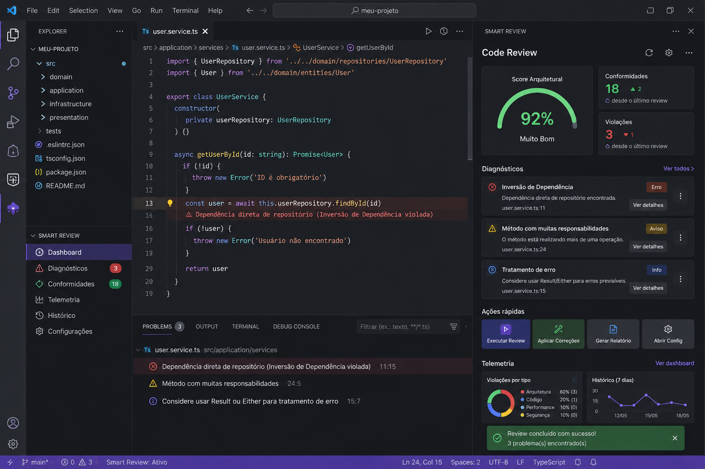
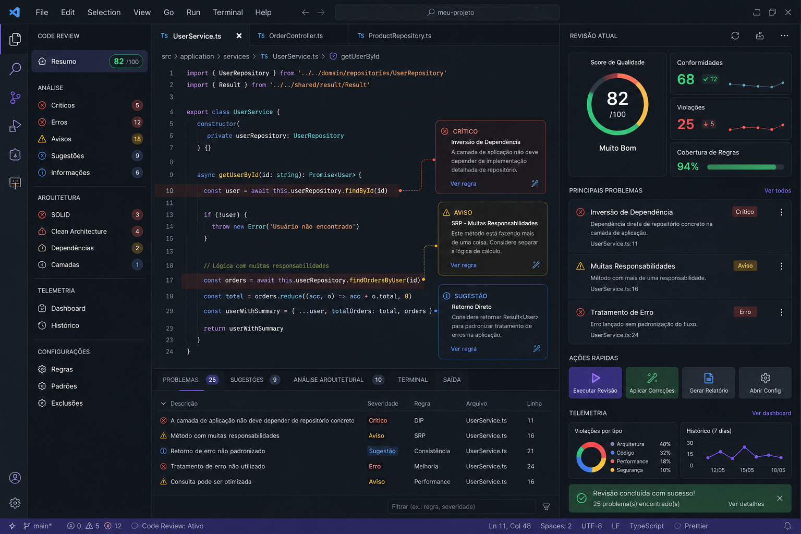
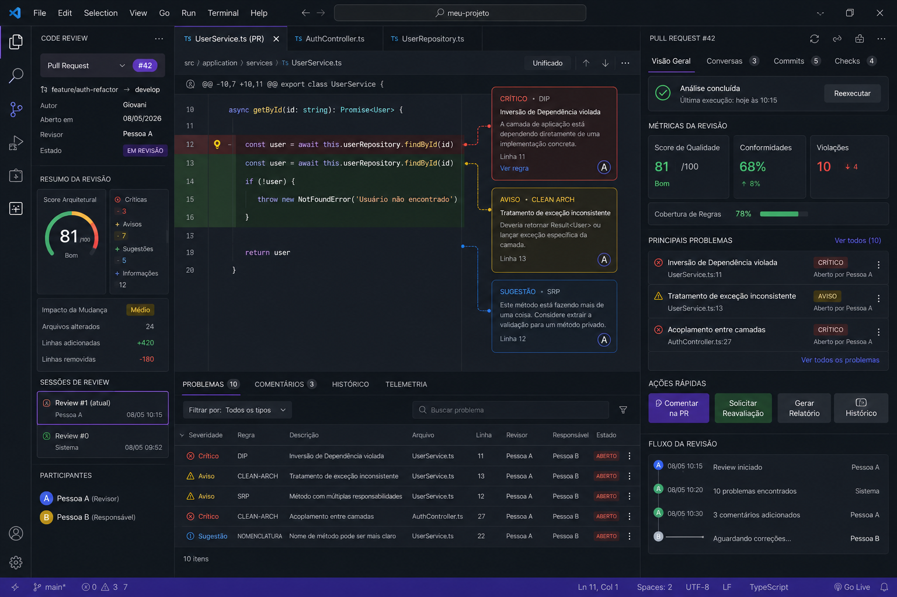

# Smart Code Review Platform

Base conceitual para uma extensão VS Code focada em:

- Code Review Inteligente
- Pull Request Review
- Arquitetura de Software
- UX/DX
- Material Design 3
- Telemetria de Engenharia
- Conformidade Arquitetural

---

## Objetivo

Transformar o processo de revisão de código em uma experiência:

- contextual
- visual
- rastreável
- colaborativa
- integrada à IDE

---

## Conceitos Principais

- UI/UX moderna
- Material Design 3
- Revisão de PR/Branch
- Telemetria
- Histórico de validações
- Revalidação automática
- Governança arquitetural

---

## Estrutura

- docs/
- images/
- rules/
- architecture/

---

## Imagens

### Dashboard de Review

### Revisão Arquitetural

### Pull Request Review

